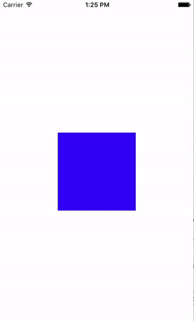

# layerMorph
Simple animated CALayer transforms from SVG's

Not really much point - but a little bit interesting and a tiny bit more fun than it should be.

Simple little toy that randomly animates color and shape.

New shapes can be added by syncing with iTunes and dropping SVG files into the app's directory.

Currently only processes single continuous straight line shapes from SVG files.

